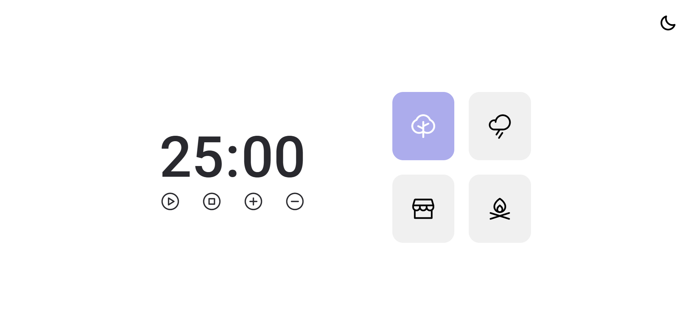
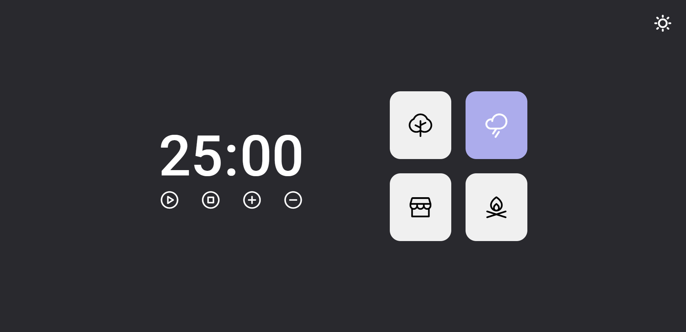

<h1 align="center">Focus Timer</h1>

  

 

  
  

 

## 🕗 Projeto 
O Focus Timer é um projeto que permite melhorar a produtividade e a gestão de tempo dos usuários. 
- [Visite o projeto online](https://breseiichi.github.io/focus-timer/)

## ⚙️ Funcionalidades 
- Alternar o tema da aplicação.
- Play: Aciona o timer.
- Pause: Pausa o timer.
- Stop: Reseta o timer.
- Ícone +: Aumenta em 5 minutos o tempo do timer.
- Ícone -: Diminui em 5 minutos o tempo do timer.
- Cards: Disponibiliza 4 tipos de sons ao usuário.

## 👾 Tecnologias 
Esse projeto foi desenvolvido com as seguintes tecnologias: 
- HTML 
- CSS
- JavaScript
- Git e Github

## 📝 Licença

Esse projeto está sob a licença MIT.

---

Projeto feito através do Programa Explorer da Rocketseat ♥